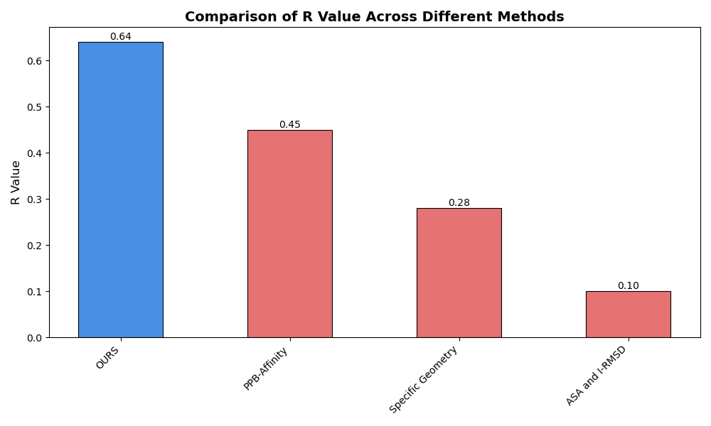

# **APPT: Affinity Protein-Protein Transformer**

## Overview

APPT (Affinity Protein-Protein Transformer) is a state-of-the-art model for predicting protein-protein binding affinity, leveraging advanced transformer architectures and the Ankh protein language model. Designed to support drug discovery, protein engineering, and biological research, APPT excels in handling protein sequence pairs and delivering precise binding affinity predictions.

## Features

- **Transformer-Based Architecture**: Utilizes attention mechanisms for capturing long-range dependencies in protein-protein interactions
- **Ankh Integration**: Leverages the Ankh protein language model for high-quality protein sequence embeddings
- **Efficient Caching**: Implements smart caching of protein embeddings to speed up repeated predictions
- **Hyperparameter Optimization**: Includes Optuna-based hyperparameter optimization
- **Command-Line Interface**: Easy-to-use CLI for making predictions

## Installation

### Requirements

PPBAT requires the following dependencies:

- Python >= 3.8
- PyTorch >= 1.12.0
- Ankh
- Optuna
- NumPy
- Pandas
- tqdm
- scikit-learn
- BioPython

## Performance Evaluation

Our model demonstrates superior performance compared to existing methods across multiple metrics:

### Mean Square Error Comparison


The graph shows that APPT achieves a significantly lower MSE (2.868) compared to PPB-Affinity (4.871), indicating better prediction accuracy. Lower values indicate better performance.

### Correlation Analysis


APPT (labeled as "OURS") achieves the highest R value of 0.64, substantially outperforming other methods:

- PPB-Affinity: 0.45
- Specific Geometry: 0.28
- ASA and RMSD: 0.10

### Comprehensive Method Comparison


In terms of R² values, our method ("OURS") achieves 0.68, significantly outperforming other approaches:

- AffinityScore: 0.25
- Rosetta: 0.27
- PyDock: 0.28
- Other methods: < 0.20

### Installation Steps

1. Clone the repository:

   ```bash
   git clone https://github.com/yourusername/PPBAT.git
   cd PPBAT
   ```
2. Install dependencies:

   ```bash
   pip install -r requirements.txt
   ```
3. Run Inference

```bash
python cli.py --sequences ABC DEF
```

## Model Architecture

PPBAT incorporates a transformer-based model with the following components:

### Base Architecture

- Protein embedding using Ankh model (768-dimensional embeddings)
- Projection layer to transform embeddings
- Multi-head self-attention layers
- Feed-forward prediction head

### Default Hyperparameters

- **Input Dimension**: 768 (Ankh embedding size)
- **Embedding Dimension**: 256
- **Linear Dimension**: 128
- **Number of Attention Layers**: 3
- **Attention Heads**: 4
- **Dropout Rate**: 0.1

## Usage

### Training

To train PPBAT on your dataset:

1. Prepare your dataset in CSV format with columns:

   - `protein1_sequence`
   - `protein2_sequence`
   - `pkd` (binding affinity)
2. Run the training script:

   ```bash
   python index.py
   ```

The training process includes:

- Automatic hyperparameter optimization using Optuna
- Early stopping and model checkpointing
- Comprehensive logging and visualization
- Caching of protein embeddings

### Making Predictions

Use the CLI tool for making predictions:

```bash
python cli.py \
    --model output/models/protein_protein_affinity.pt \
    --sequences ABC DEF \
    --sequences XYZ ABC \
    --output prediction_results.json \
    --device cpu \
    --log-file predictions.log
```

CLI Arguments:

- `--model`: Path to trained model checkpoint
- `--protein1`: Sequence of first protein
- `--protein2`: Sequence of second protein
- `--cache-dir`: Directory for embedding cache (optional)
- `--output`: Path for prediction output (optional)
- `--device`: Computing device (cpu/cuda)
- `--log-file`: Path to log file (optional)

Example output (prediction_results.json):

```json
{
    "pKd": 7.24,
    "Kd": 5.7543993733715665e-08
}
```

## Project Structure

- `index.py`: Main training script and model implementation
- `PPBAT_cli.py`: Command-line interface for predictions
- `output/`: Directory containing:
  - `models/`: Trained model checkpoints
  - `embedding_cache/`: Cached protein embeddings
  - `hyperopt_results.json`: Hyperparameter optimization results
  - Various visualization plots

## Output Files

The training process generates several output files:

- Model checkpoints
- Hyperparameter optimization results
- Training history plots
- Prediction vs. actual plots
- Detailed logs

## Contributing

We welcome contributions to improve PPBAT. Please feel free to submit issues and pull requests.

## License

This project is distributed under the X License. See LICENSE for details.
