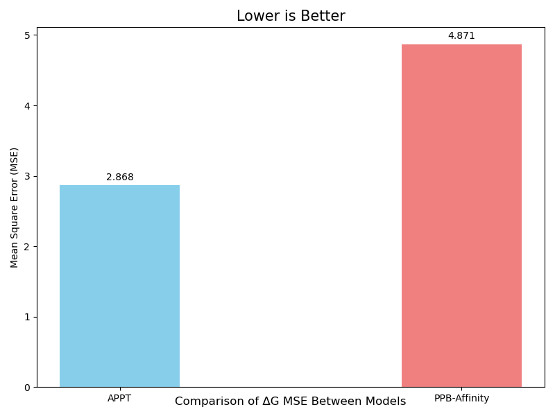
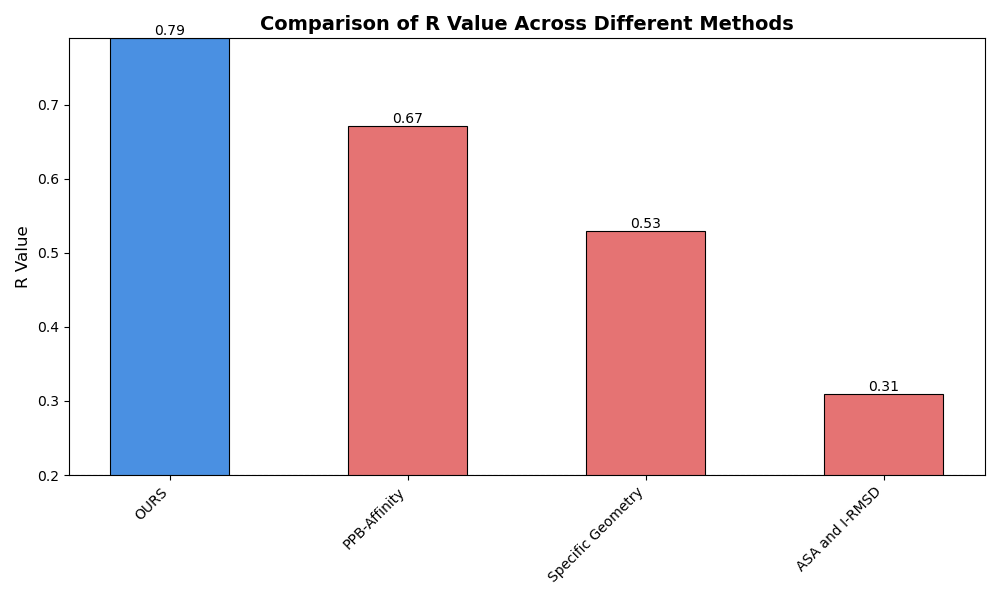
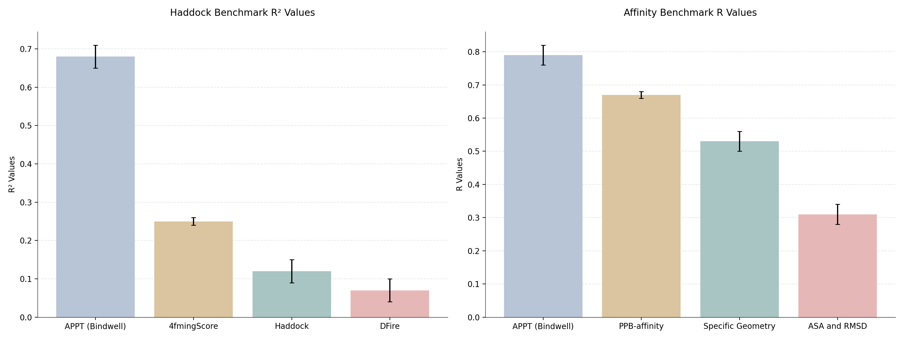

# **APPT: Affinity Protein-Protein Transformer**

## Overview

APPT (Affinity Protein-Protein Transformer) is a state-of-the-art model for predicting protein-protein binding affinity, leveraging advanced transformer architectures and the ESM protein language model. Designed to support drug discovery, protein engineering, and biological research, APPT excels in handling protein sequence pairs and delivering precise binding affinity predictions.

## Features

- **Transformer-Based Architecture**: Utilizes attention mechanisms for capturing long-range dependencies in protein-protein interactions
- **ESM Integration**: Leverages the ESM protein language model for high-quality protein sequence embeddings
- **Efficient Caching**: Implements smart caching of protein embeddings to speed up repeated predictions
- **Hyperparameter Optimization**: Includes Optuna-based hyperparameter optimization
- **Command-Line Interface**: Easy-to-use CLI for making predictions

### Installation

For extra assistance installing please see our [Bindwell AI]([https://chatgpt.com/share/6744e111-b818-8008-be2b-a55556aba9b6](https://chatgpt.com/g/g-EZBMf8gIt-bindwell-ai))

1. Clone the repository:

   ```bash
   git clone https://github.com/Bindwell/APPT.git
   cd APPT
   ```
2. Install dependencies:

   ```bash
   pip install -r requirements.txt
   cd embedding_cache_2560
   wget https://huggingface.co/Bindwell/APPT/resolve/main/caches.pt
   cd .. 
   ```
3. Run Inference

   ```bash
   python cli.py --sequences ABC DEF
   ```

## Performance Evaluation

Our model demonstrates superior performance compared to existing methods across multiple metrics:

### Mean Square Error Comparison



The graph shows that APPT achieves a significantly lower MSE (2.868) compared to PPB-Affinity (4.871), indicating better prediction accuracy. Lower values indicate better performance.

### Correlation Analysis



APPT (labeled as "OURS") achieves the highest R value of 0.79, substantially outperforming other methods:

- PPB-Affinity: 0.67
- Specific Geometry: 0.53
- ASA and RMSD: 0.31

### Comprehensive Method Comparison



In terms of R² values, our method ("OURS") achieves 0.68, significantly outperforming other approaches:

- AffinityScore: 0.25
- Rosetta: 0.27
- PyDock: 0.28
- Other methods: < 0.20

## Model Architecture

APPT incorporates a transformer-based model with the following components:

### Base Architecture

- Protein embedding using ESM model (2560-dimensional embeddings)
- Projection layer to transform embeddings
- Multi-head self-attention layers
- Feed-forward prediction head

### Default Hyperparameters

- **Input Dimension**: 2560 (ESM embedding size)
- **Embedding Dimension**: 384
- **Linear Dimension**: 160
- **Number of Attention Layers**: 4
- **Attention Heads**: 4
- **Batch Size**: 16
- **Dropout Rate**: 0.1
- **Learning Rate**: 6.30288565853412e-05

## Training

### Custom dataset

To train APPT on your dataset:

1. Prepare your dataset in CSV format with columns:

   - `protein1_sequence`
   - `protein2_sequence`
   - `pkd` (binding affinity)
2. Replace the Data.csv file in `index.py`
3. Run the training script:

   ```bash
   python index.py
   ```

The training process includes:

- Automatic hyperparameter optimization using Optuna
- Early stopping and model checkpointing
- Comprehensive logging and visualization
- Caching of protein embeddings

## APPT Prediction CLI

A command-line interface for predicting binding affinity between protein pairs.

### Usage

You can provide input either through a CSV file containing protein sequences or by directly passing sequence pairs:

#### Using CSV input:

```bash
python cli.py \
    --input_csv data/protein_pairs.csv \
    --protein1_col protein1_sequence \
    --protein2_col protein2_sequence \
    --output_dir results \
    --model_path models/protein_protein_affinity_esm_vs_ankh_best.pt \
    --device cuda
```

#### Using raw sequences:

```bash
python cli.py \
    --sequences SEQUENCE1A SEQUENCE1B \
    --sequences SEQUENCE2A SEQUENCE2B \
    --output_dir results \
    --model_path models/protein_protein_affinity_esm_vs_ankh_best.pt \
    --device cpu
```

### Arguments

#### Required (mutually exclusive):

- `--input_csv`: Path to CSV file containing protein sequences
- `--sequences`: Raw protein sequence pairs (can be specified multiple times for multiple pairs)

#### Optional:

- `--protein1_col`: Column name for first protein sequences in CSV (default: 'protein1_sequence')
- `--protein2_col`: Column name for second protein sequences in CSV (default: 'protein2_sequence')
- `--output_dir`: Directory to save results (default: 'output')
- `--model_path`: Path to trained model checkpoint (default: 'models/protein_protein_affinity_esm_vs_ankh_best.pt')
- `--data_path`: Path to training data for normalization parameters (default: 'Data.csv')
- `--batch_size`: Batch size for inference (default: 16)
- `--device`: Device to run inference on (default: cuda if available, else cpu)

#### Model Configuration:

- `--input_dim`: Input dimension of protein embeddings (default: 2560)
- `--embedding_dim`: Embedding dimension for transformer (default: 384)
- `--linear_dim`: Linear layer dimension (default: 160)
- `--num_attention_layers`: Number of transformer attention layers (default: 2)
- `--num_heads`: Number of attention heads (default: 4)
- `--dropout_rate`: Dropout rate (default: 0.1)

### Output

The script saves results to a CSV file in the specified output directory (default: 'output/binding_predictions.csv') with the following columns:

- Protein1_Sequence: First protein sequence
- Protein2_Sequence: Second protein sequence
- Predicted_pKd: Predicted binding affinity (pKd value)

Example output CSV:

```csv
Protein1_Sequence,Protein2_Sequence,Predicted_pKd
SEQUENCE1A,SEQUENCE1B,7.24
SEQUENCE2A,SEQUENCE2B,6.85
```

## Project Structure

- `index.py`: Main training script and model implementation
- `cli.py`: Command-line interface for predictions
- `output/`: Directory containing:
  - `models/`: Trained model checkpoints
  - `embedding_cache/`: Cached protein embeddings
  - `hyperopt_results.json`: Hyperparameter optimization results
  - `Figures`: Various visualization plots

## Output Files

The training process generates several output files:

- Model checkpoints
- Hyperparameter optimization results
- Training history plots
- Prediction vs. actual plots
- Detailed logs

## Contributing

We welcome contributions to improve APPT. Please feel free to submit issues and pull requests.

## License

This project is distributed under the CC BY NC SA License. See LICENSE for details.
